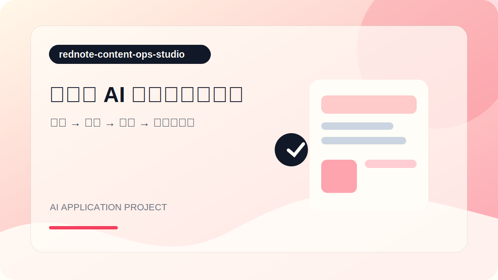
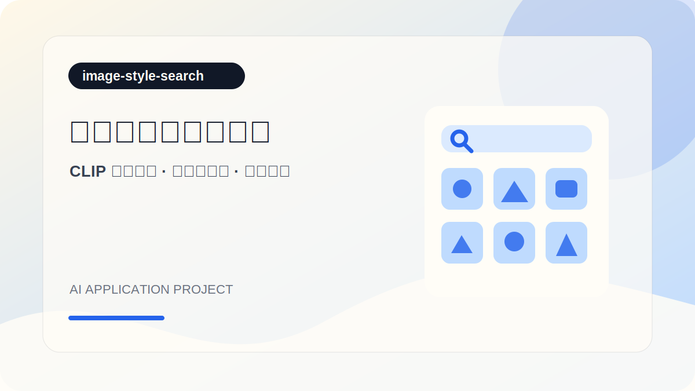
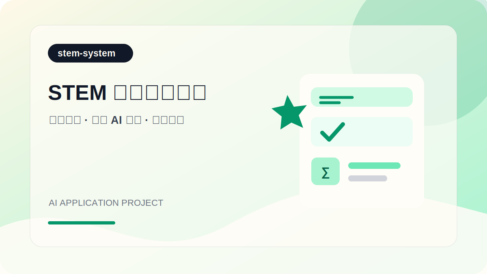
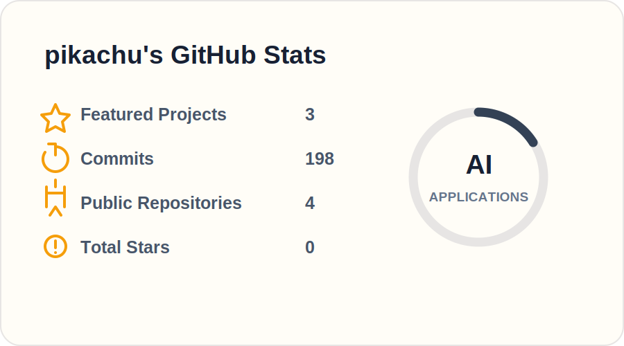
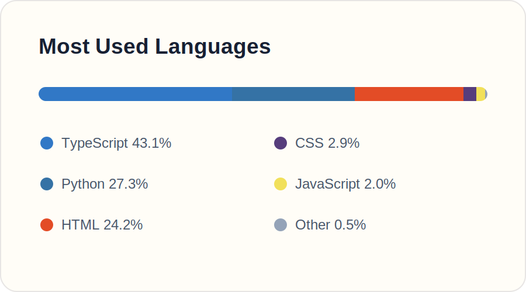

  

# 你好，我是 pikachu 👋

### 在数据、模型与创意之间，做能陪人把想法落地的 AI 产品

正在寻找 AI、机器学习或数据应用相关的机会。我喜欢从一张草图、一段用户反馈或一团复杂的数据开始，把它们整理成可验证的智能工作流与可运行的产品。

---

## Route

  

数据与模型 · Agent / 工作流 · 产品化部署 · 评估与迭代

---

## 我关注什么

- **可复现**：用清晰的环境、数据与实验记录，让结果能够被他人验证。
- **可评估**：先定义指标和对照，再讨论模型与方案是否真正有效。
- **可交付**：将探索性原型整理成易运行、易理解、易维护的项目。

## 技术方向

  
  
  
  
  
  

## 精选项目

> 我将项目设计为可运行、可追踪、可复盘的 AI 产品；每个仓库都包含完整的启动说明、技术架构和已知限制。

<table width="100%">
  <tr>
    <td width="50%"></td>
    <td width="50%"></td>
  </tr>
  <tr>
    <td width="50%"></td>
    <td width="50%"></td>
  </tr>
</table>

<!--
新增项目时，请使用可核验表述，不要编造指标：
| [项目名称](https://github.com/peteryipikachu-cpu/仓库名) | 使用 X 完成 Y；在 Z 数据集/场景下达到指标 N | [代码](链接) · [演示](链接) |
-->

## Signals

  
  

基于 4 个代表项目的公开代码统计 · 更新于 2026-07-21

## Contact

AI 应用工程、智能内容工具或多模态产品方向的交流与合作，欢迎通过 [GitHub](https://github.com/peteryipikachu-cpu) 联系我。
