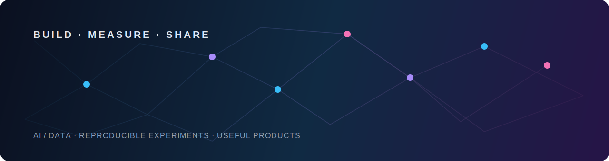

  

# 你好，我是 peteryipikachu-cpu 👋

### AI / 数据方向求职者 · 关注可复现的模型实验与数据产品

我正在寻找 AI、机器学习或数据相关的机会，喜欢把问题拆解为可验证的数据流程、模型实验和可运行的应用。

## 我关注什么

- **可复现**：用清晰的环境、数据与实验记录，让结果能够被他人验证。
- **可评估**：先定义指标和对照，再讨论模型与方案是否真正有效。
- **可交付**：将探索性原型整理成易运行、易理解、易维护的项目。

## 技术方向

  
  
  
  
  

> 请只保留你实际使用过的技术标签；具体替换清单见 [PROFILE_CONTENT_CHECKLIST.md](./PROFILE_CONTENT_CHECKLIST.md)。

## 精选项目

> 正在将可公开展示的项目整理为完整案例。每个案例都会说明问题、职责、技术方案、可复现步骤与可核验结果。

| 项目 | 你将看到什么 | 链接 |
| --- | --- | --- |
| 数据项目 / 模型项目（待补充） | 问题定义、数据来源、方法、指标与复现说明 | [浏览全部仓库](https://github.com/peteryipikachu-cpu?tab=repositories) |
| 数据项目 / 模型项目（待补充） | 问题定义、数据来源、方法、指标与复现说明 | [浏览全部仓库](https://github.com/peteryipikachu-cpu?tab=repositories) |
| 数据项目 / 模型项目（待补充） | 问题定义、数据来源、方法、指标与复现说明 | [浏览全部仓库](https://github.com/peteryipikachu-cpu?tab=repositories) |

<!--
替换每一行时，请使用可核验表述，不要编造指标：
| [项目名称](https://github.com/peteryipikachu-cpu/仓库名) | 使用 X 完成 Y；在 Z 数据集/场景下达到指标 N | [代码](链接) · [演示](链接) |
-->

## GitHub 动态

  
  

## 正在学习与贡献

- 持续完善可复现的 AI / 数据项目，并将关键决策与局限写入 README。
- 欢迎提出改进建议、交流数据与机器学习实践，或关注后续公开的项目案例。

## 联系我

目前最稳定的联系入口是 [GitHub 主页](https://github.com/peteryipikachu-cpu)。

<!-- 在确认公开意愿后，替换为你的简历、邮箱、LinkedIn、博客或知乎链接。不要在仓库中提交敏感联系方式。 -->

